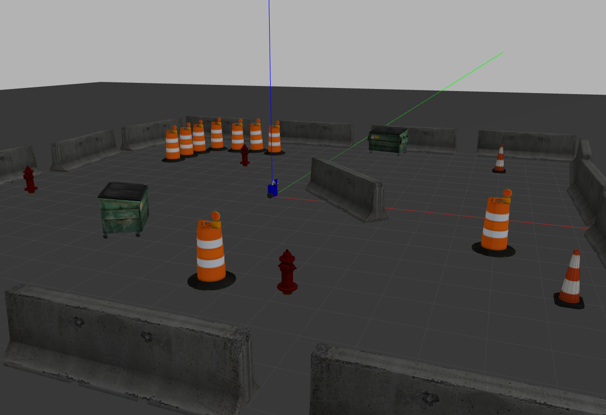

# I3E-D3
A project of a openSource robotic plataform, developed by the IEEE RAS CIMATEC Student Chapter.


## Install the packages
- First, create a ROS workspace:
```bash
$ mkdir -p ~/i3e-d3_ws/src
```
- Clone this repository inside your /src folder:
```bash
$ cd i3e-d3_ws/src
$ git clone https://github.com/rascimatec/i3e-d3
```
- Install all dependencies and build your workspace:
```bash
$ cd ~/i3e-d3_ws
$ rosdep install --from-paths src --ignore-src --rosdistro=noetic -y
$ catkin_make
```

## Package contents
- **delta_lidar:** LIDAR SDK package, cloned from https://github.com/biomchen/3irobotics-delta2a-sdk
- **i2c_device_ros:** I2C interface for ROS, cloned from https://github.com/Brazilian-Institute-of-Robotics/i2c_device_ros
- **mpu6050_driver:** Driver for use MPU6050 IMU, cloned from https://github.com/Brazilian-Institute-of-Robotics/mpu6050_driver
- **i3e-d3_bringup:** Package for starting the I3E-D3 robot
- **i3e-d3_control:** Control and teleoperation of the robot
- **i3e-d3_description:** I3E-D3 description, URDF and mesh files
- **i3e-d3_gazebo:** Gazebo worlds for simulation
- **i3e-d3_launchs:** A useful package for launch files
- **i3e-d3_navigation:** SLAM and move_base, used for navigation
- **i3e-d3_viz:** Package for visualization

## Simulation
When open a new terminal:
```bash
$ cd ~/i3e-d3_ws
$ source devel/setup.bash
```
The i3e-d3_launchs package provides some useful launch files for simulation. 
By default, it will start the Playpen world, but you can change it if you want.

Also, if you want to make your own launch file, you can be based on the 'template.launch'.

### Teleoperation
You just teleoperate the robot, using a generical joystick.
```bash
$ roslaunch i3e-d3_launchs teleoperation.launch
```



A gazebo world will open, and you can control the robot on the map, using a generic joystick.
Of course, you can change the world if you want, 
but remember to change the map to be loaded as well, if yout want to view it in Rviz.

### Mapping with Teleoperation
The robot will map the environment using teleoperation.
```bash
$ roslaunch i3e-d3_launchs mapping_teleop.launch
```


Rviz will open, and you can see that as you control the robot, the environment will be mapped.
When you finish the mapping, run the map_saver in a second terminal, 
so that you can load this map in the future:
```bash
$ rosrun map_server map_saver -f <filename>
```
Preferably save it in the *i3e-d3_navigation* package, 
inside the */map* folder.

### Mapping with Navigaton
The robot will map the environment using navigation.
```bash
$ roslaunch i3e-d3_launchs mapping_nav.launch
```
It works like the *mapping with teleoperation*, but instead of use a 
joystick, you can use the **2D Nav Goal** tool of Rviz to set a position 
and orientation in the world, and the robot will map the environment while navigating.


By default, the SLAM method (for simultaneous mapping and localization) is
hector_slam, and the *base_local_planner* of *move_base* is teb_planner, 
but you can change it if you want.

You can run *map_saver* to save the map:
```bash
$ rosrun map_server map_saver -f <filename>
``` 

### Autonomous Navigation
The robot will navigate through a known map.
```bash
$ roslaunch i3e-d3_launchs navigation.launch
```


You can use the **2D Nav Goal** tool of Rviz to navigate the robot, 
and the **2D Pose Estimate** to estimate a pose of the robot in the map (using AMCL node), 
if necessary. 

### Autonomous Exploration
The robot will explore the world on its own until the mapping is complete.
```bash
$ roslaunch i3e-d3_launchs exploration.launch
```


It will do the same as the *mapping with navigation*, but will also run a node 
that provides a autonomous exploration to the robot, so that it will navigate
by itself, until the mapping is complete. Enable the *MarkerArray* in the Displays panel
of Rviz, so that you can see the "edges" of your mapping.


You can run *map_saver* to save the map:
```bash
$ rosrun map_server map_saver -f <filename>
``` 
